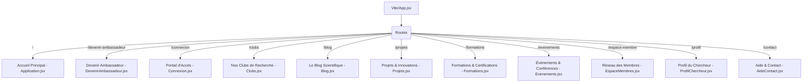

# ⬡ FIERI Research — Documentation Technique & Fonctionnelle

Bienvenue dans la documentation officielle de **FIERI Research**, la plateforme web de pointe dédiée à la recherche scientifique, à l'innovation technologique, et à la collaboration entre étudiants et chercheurs. 

Ce document détaille l'architecture visuelle (Design System), la cartographie complète des interfaces (Pages), les composants réutilisables, l'ensemble des sections dynamiques et l'organisation du contenu de l'application.

---

## 🧭 Sommaire
1. [👁️ Vision & Stack Technique](#1-vision--stack-technique)
2. [🎨 Design System & Esthétique](#2-design-system--esthétique)
3. [🗺️ Cartographie des Interfaces (Pages)](#3-cartographie-des-interfaces-pages)
4. [🧱 Composants Globaux & Utilitaires](#4-composants-globaux--utilitaires)
5. [🖥️ Sections de l'Accueil Principal](#5-sections-de-laccueil-principal)
6. [🗄️ Modèle & Structure du Contenu](#6-modèle--structure-du-contenu)
7. [🔐 Matrice des Permissions & Flux Utilisateur](#7-matrice-des-permissions--flux-utilisateur)

---

## 1. 👁️ Vision & Stack Technique

**FIERI Research** est conçu comme un écosystème numérique immersif et fluide, transformant le modèle académique traditionnel en une expérience premium de style "SaaS Scientifique" ou "Hub d'Innovation". 

### La Stack Technique
*   **Framework Core** : React (v18+) avec Vite pour un chargement et un HMR ultra-rapides.
*   **Routage** : `react-router-dom` pour une expérience d'application mono-page (SPA) fluide.
*   **Stylisation** : Vanilla CSS customisé hautement optimisé (`index.css`) offrant une flexibilité totale et des performances maximales.
*   **Animations** : **GSAP (GreenSock Animation Platform)** combinée avec l'**Intersection Observer API** pour orchestrer des micro-interactions cinétiques fluides (fondus, glissements, compteurs dynamiques, effets magnétiques).
*   **Éléments Interactifs & Visuels** : Intégration de canvas interactifs (Orbes d'énergie) et d'un montage composite de la communauté avec widgets flottants GSAP.

---

## 2. 🎨 Design System & Esthétique

La charte graphique de **FIERI Research** repose sur une identité visuelle d'inspiration cosmique et scientifique moderne ("Dark Cosmique"), tout en supportant un commutateur de thème clair/sombre.

### Thème Sombre & Thème Clair

| Token CSS | Thème Sombre (Défaut) | Thème Clair (Actif) |
| :--- | :--- | :--- |
| `bg-main` | Deep Space Navy (`#030712`) | Soft Ash Gray (`#F9FAFB`) |
| `surface` | Translucide Dark (`rgba(17, 24, 39, 0.7)`) | Pure White Translucide (`rgba(255, 255, 255, 0.8)`) |
| `text-main` | Cosmic White (`#F3F4F6`) | Charcoal Gray (`#111827`) |
| `text-muted` | Stardust Gray (`#9CA3AF`) | Slate Gray (`#4B5563`) |
| `accent` | Cyber Orange (`#F97316`) | Energetic Coral (`#EA580C`) |
| `brand` | Ocean Blue (`#2563EB`) | Deep Tech Blue (`#1D4ED8`) |
| `glow` | Cyan Nebula (`#06B6D4`) | Electric Turquoise (`#0891B2`) |

### Principes Esthétiques Fondamentaux
1.  **Glassmorphism Discret** : Utilisation intensive de la propriété CSS `backdrop-filter: blur(12px)` couplée à des bordures semi-transparentes (`rgba(255,255,255,0.07)`) pour donner de la profondeur aux cartes et barres de navigation.
2.  **Surfaces Tonales** : Les sections sont délimitées par des variations subtiles de couleur de fond et des gradients de flou (`filter: blur(80px)`) plutôt que par des séparateurs physiques durs.
3.  **L'accentuation Cyan (Pulse)** : La couleur Cyan est exclusivement réservée aux indicateurs d'état en direct ("Live"), aux badges d'innovations actives et aux points de focus interactifs.
4.  **Typographie Premium** : 
    *   **Titres** : `Manrope` (Moderne, géométrique et lisible) avec un espacement de lettres resserré pour un look éditorial affirmé.
    *   **Corps de texte** : `Inter` (Standard d'accessibilité, haute lisibilité).

---

## 3. 🗺️ Cartographie des Interfaces (Pages)

L'application est orchestrée dans `App.jsx` sous 10 routes principales, chacune correspondant à un cas d'utilisation ou un pôle fonctionnel précis.



### Détail de chaque interface :

#### 1. Accueil Principal (`/`)
*   **Fichier** : `src/Application.jsx`
*   **Rôle** : Hub d'atterrissage. Présente la vision globale de la FIERI, agrège les données clés et redirige l'utilisateur vers les entités spécifiques via des appels à l'action (CTA) percutants.

#### 2. Devenir Ambassadeur (`/devenir-ambassadeur`)
*   **Fichier** : `src/pages/DevenirAmbassadeur.jsx`
*   **Rôle** : Landing page de recrutement pour les leaders locaux du FIERI. Elle contient :
    *   Un manifeste d'impact.
    *   Les piliers des missions d'ambassadeur (Représentation, animation scientifique).
    *   Le programme d'avantages (Kit de représentation, accréditation VIP).
    *   Un formulaire d'application multi-étapes lié à la plateforme d'inscription.

#### 3. Portail de Connexion (`/connexion`)
*   **Fichier** : `src/pages/Connexion.jsx`
*   **Rôle** : Interface de sécurité hybride (Connexion / Inscription) animée avec des transitions fluides. Permet l'authentification des chercheurs, étudiants et partenaires.

#### 4. Pôles de Recherche (`/clubs`)
*   **Fichier** : `src/pages/Clubs.jsx`
*   **Rôle** : Présentation détaillée des six pôles scientifiques majeurs. Comprend des filtres avancés par discipline et statut de recherche, ainsi qu'un espace dédié à la recherche de mentors académiques.

#### 5. Le Blog Scientifique (`/blog`)
*   **Fichier** : `src/pages/Blog.jsx`
*   **Rôle** : Fil éditorial technique et scientifique. Offre une grille d'articles ("Bento Grid" sur les grands écrans) avec recherche de texte en temps réel et filtres thématiques (IA, Énergie, Robotique, etc.).

#### 6. Projets & Innovations (`/projets`)
*   **Fichier** : `src/pages/Projets.jsx`
*   **Rôle** : Vitrine des réalisations technologiques du FIERI. Elle propose une vue interactive des prototypes en cours de développement (Smart Farming, Impression 3D, Smart Grids) triés par niveau de maturité (TRL - Technology Readiness Level).

#### 7. Formations & Ateliers (`/formations`)
*   **Fichier** : `src/pages/Formations.jsx`
*   **Rôle** : Catalogue des modules d'apprentissage dispensés par **L'Académie FIERI**. Les utilisateurs peuvent s'inscrire en direct ou rejoindre une liste d'attente automatisée si le quota de participants est atteint.

#### 8. Événements & Conférences (`/evenements`)
*   **Fichier** : `src/pages/Evenements.jsx`
*   **Rôle** : Liste chronologique des webinaires, hackathons nationaux et soutenances scientifiques. Les événements actifs incluent un badge "En Direct" et un lien d'accès au flux de diffusion vidéo.

#### 9. Espace Membres (`/espace-membre`)
*   **Fichier** : `src/pages/EspaceMembres.jsx`
*   **Rôle** : Le cœur de l'écosystème collaboratif. Une fois connectés, les membres accèdent à des flux de publications internes, un tableau de bord de suivi de projets, et des outils de soumission de brevets.

#### 10. Profil Chercheur (`/profil`)
*   **Fichier** : `src/pages/ProfilChercheur.jsx`
*   **Rôle** : Fiche d'identité académique publique pour les chercheurs affiliés à l'Institut FIERI. Affiche les statistiques (H-Index, citations), les publications scientifiques liées, et une option pour entrer en contact direct.

#### 11. Aide & Support (`/contact`)
*   **Fichier** : `src/pages/AideContact.jsx`
*   **Rôle** : Centre de support client équipé d'une FAQ interactive par catégories (Adhésion, Financement, Technique) et d'un formulaire de ticket de support.

---

## 4. 🧱 Composants Globaux & Utilitaires

Situés dans `src/components`, ces composants réutilisables garantissent la cohérence fonctionnelle et visuelle de la plateforme.

### 🏢 Structure & Navigation
*   **`BarreNavigation.jsx`** : Barre de navigation adaptative. Elle intègre le logo FIERI, les liens de navigation, le bouton d'appel à l'action dynamique ("Intégrez un club"), et le commutateur de thème (Sombre / Clair) stocké dans le `localStorage` de l'utilisateur. En mode mobile, elle se transforme en menu tiroir fluide.
*   **`PiedDePage.jsx`** : Footer informatif et structuré. Il regroupe les raccourcis de navigation, les contacts d'urgence (Email, WhatsApp direct), et les mentions de copyright.

### 🎨 Ambiance & Beauté Visuelle
*   **`BackgroundGrid.jsx`** : Génère une grille de fond matricielle (Blueprint Grid) typique des plans d'ingénieurs, agrémentée d'étoiles scintillantes et d'orbes de lumière colorés qui suivent les mouvements de l'écran pour un effet de parallaxe captivant.
*   **`OrbField.jsx`** : Système de particules interactives développé sur Canvas HTML5, créant un nuage d'énergie cinétique réactif au survol de la souris sur les pages de destination.
*   **Illustration Composite & Widgets Flottants (Section Accueil)** : Un cadre visuel haut de gamme combinant une photographie communautaire HD recadrée avec un filtre de couleur cinétique (au survol) et des widgets overlays flottants animés par GSAP (Radar de recherche, Compteur d'écosystème).

### ⚙️ Micro-interactions & Helpers d'Animation
*   **`Magnetic.jsx`** : Wrapper basé sur les forces physiques d'attraction. Il capture le curseur de la souris lorsqu'il s'approche d'un bouton d'action principal et applique un effet d'aspiration magnétique fluide pour inciter à l'interaction.
*   **`FonduMontee.jsx`** : Utilise l'API `IntersectionObserver` pour détecter le défilement de la page et déclencher des animations GSAP d'apparition en fondu et glissement vers le haut (`fade-in-up`) au fur et à mesure que les sections entrent dans le champ de vision de l'utilisateur.
*   **`Compteur.jsx`** : Script d'incrémentation dynamique de chiffres. Lors du défilement, ce composant anime les statistiques (par exemple : de 0 à 5000+ membres) avec une courbe d'accélération naturelle (Ease Out).
*   **`PointStatut.jsx`** : Petit badge circulaire doté d'une animation CSS de pulsation (`ping`), utilisé pour signaler des états actifs ("LIVE", "Projet Actif").
*   **`MemberCarousel.jsx`** : Carrousel interactif fluide pour faire défiler les témoignages des étudiants et les profils de chercheurs phares avec transitions accélérées par le processeur graphique.
*   **`AfriChatBootstrap.jsx`** : Système d'amorçage de l'assistant conversationnel instantané AfriChat intégré, positionné discrètement en bas à droite de l'interface.

---

## 5. 🖥️ Sections de l'Accueil Principal

Le fichier `Application.jsx` assemble 11 sections clés pour former l'expérience de la page d'accueil. Chaque section est alimentée de façon étanche par une branche spécifique de `siteContent.json`.

```
+-------------------------------------------------------------+
|                     SectionAccueil (Hero)                    |
+-------------------------------------------------------------+
|              SectionNousDecouvrir (Les 3 Entités)            |
+-------------------------------------------------------------+
|                SectionMission (Les 4 Piliers)               |
+-------------------------------------------------------------+
|                SectionActualites (Le Journal)               |
+-------------------------------------------------------------+
|            SectionHiBlog (Inspirations & Insights)          |
+-------------------------------------------------------------+
|               SectionClub (Pôles de Recherche)              |
+-------------------------------------------------------------+
|              SectionEvenements (Concours & Livestream)      |
+-------------------------------------------------------------+
|            SectionPAF (Accompagnement & Mentorat)           |
+-------------------------------------------------------------+
|                 SectionStats (Données chiffrées)             |
+-------------------------------------------------------------+
|                      SectionFAQ (Accordéon)                 |
+-------------------------------------------------------------+
|                     SectionContact (Formulaire)             |
+-------------------------------------------------------------+
```

### 1. SectionAccueil (Hero)
*   **Composant** : `SectionAccueil.jsx`
*   **Contenu lié** : `contenu.hero`
*   **Description** : L'accroche au-dessus de la ligne de flottaison (Above the fold). Elle affiche la bannière institutionnelle "Front International des Étudiants et Chercheurs", un titre à fort impact, une description inspirante et deux boutons d'action magnétiques.
*   **Animation** : Lettrage en cascade de gauche à droite au chargement initial.

### 2. SectionNousDecouvrir (Les Entités)
*   **Composant** : `SectionNousDecouvrir.jsx`
*   **Contenu lié** : `contenu.decouvrir`
*   **Description** : Présente les trois piliers organisationnels de la FIERI sous forme de trois colonnes interactives :
    1.  **La Cité FIERI** (Écoles, hackathons, prototypage étudiant).
    2.  **L'Académie FIERI** (Développement de compétences, certifications).
    3.  **L'Institut FIERI** (Recherche appliquée, transfert technologique industriel).

### 3. SectionMission (Les Piliers de l'Engagement)
*   **Composant** : `SectionMission.jsx`
*   **Contenu lié** : `contenu.mission`
*   **Description** : Grille de 4 cartes présentant les valeurs fondamentales : *Inspiration Scientifique, Innovation Pratique, Réseau Collaboratif, et Accompagnement*.

### 4. SectionActualites (Le Journal)
*   **Composant** : `SectionActualites.jsx`
*   **Contenu lié** : `contenu.actualites`
*   **Description** : Les 3 dernières actualités majeures du front sous forme de cartes d'actualités structurées chronologiquement avec date de publication, titre accrocheur, et court extrait de lecture.

### 5. SectionHiBlog (Aperçu Inspirations)
*   **Composant** : `SectionHiBlog.jsx`
*   **Contenu lié** : `contenu.hiblog`
*   **Description** : Cartes horizontales compactes mettant en avant des thématiques technologiques précises (IA, Énergies renouvelables, Robotique) avec leur temps de lecture estimé pour susciter la curiosité du lecteur.

### 6. SectionClub (Les Laboratoires Spécialisés)
*   **Composant** : `SectionClub.jsx`
*   **Contenu lié** : `contenu.clubs`
*   **Description** : Met en valeur les six pôles de recherche de la FIERI avec une interface hautement interactive :
    *   **Robotique & Automatisation** (Accent Orange)
    *   **Informatique Industrielle & IoT** (Accent Bleu)
    *   **Éco-énergie & Climatisation** (Accent Vert)
    *   **Construction 4.0** (Accent Orange)
    *   **Intelligence Artificielle** (Accent Bleu)
    *   **Innovation Technologique & Entrepreneuriat** (Accent Vert)
    *   *Chaque carte détaille les divisions internes (ex: BIM, Impression 3D), les activités clés et le projet phare en cours.*

### 7. SectionEvenements (Hackathons & Concours)
*   **Composant** : `SectionEvenements.jsx`
*   **Contenu lié** : `contenu.evenements`
*   **Description** : Présente les trois types de rencontres organisées (Concours nationaux, Ateliers techniques, Conférences professionnelles) avec des boutons de redirection directe.

### 8. SectionPAF (Programme d'Accompagnement & Formations)
*   **Composant** : `SectionPAF.jsx`
*   **Contenu lié** : `contenu.paf`
*   **Description** : Expose le cadre d'accompagnement proposé aux porteurs de projets prometteurs (Mentorat par des experts, Accès libre aux laboratoires physiques, Financement et Bourses de R&D).
*   **Micro-interactions** : Glissement latéral et changement de couleur de bordure au survol.

### 9. SectionStats (Indicateurs d'Impact)
*   **Composant** : `SectionStats.jsx`
*   **Contenu lié** : `contenu.stats`
*   **Description** : Bandeau transversal de prestige affichant les compteurs chiffrés réels animés par GSAP :
    *   **5000+** Membres actifs
    *   **6** Clubs de recherche
    *   **120+** Projets technologiques menés à bien
    *   **30+** Partenaires industriels et académiques

### 10. SectionFAQ (Foire Aux Questions)
*   **Composant** : `SectionFAQ.jsx`
*   **Contenu lié** : `contenu.faq`
*   **Description** : Système d'accordéon interactif permettant aux nouveaux visiteurs d'obtenir des réponses rapides sur l'accès aux clubs, les critères d'éligibilité pour soumettre un projet et les modalités de gratuité des formations.

### 11. SectionContact (Formulaire & Localisation)
*   **Composant** : `SectionContact.jsx`
*   **Contenu lié** : `contenu.contact`
*   **Description** : Section finale d'engagement contenant un formulaire de contact professionnel validé côté client (Nom, email, objet, message) et les coordonnées géographiques du siège (Campus universitaire, Bloc technologique).

---

## 6. 🗄️ Modèle & Structure du Contenu

Le fichier unique `src/content/siteContent.json` sert de CMS (Content Management System) local et centralisé pour l'ensemble de l'application. Cette architecture est idéale pour une transition ultérieure fluide vers une base de données ou un CMS headless (type Strapi ou Sanity).

### Exemple de structure d'un bloc de contenu (`siteContent.json`) :
```json
{
  "meta": {
    "title": "FIERI | Innovation Technologique",
    "language": "fr"
  },
  "hero": {
    "eyebrow": {
      "prefix": "Front International des Étudiants et Chercheurs //",
      "highlight": "FIERI"
    },
    "title": {
      "beforeHighlight": "Rejoignez le front des",
      "highlight": "étudiants et chercheurs"
    },
    "description": "Nous formons, nous connectons et nous propulsons la nouvelle génération de chercheurs et innovateurs.",
    "buttons": [
      { "label": "Intégrez un club de recherche", "variant": "primary" },
      { "label": "Nos clubs", "variant": "outline" }
    ]
  }
}
```

---

## 7. 🔐 Matrice des Permissions & Flux Utilisateur

L'application gère 4 profils d'utilisateurs distincts. Les barrières de sécurité (Auth Gates) protègent les sections privées ou interactives.

### Rôles & Accès

| Profil d'Utilisateur | Droits de Lecture Publique (Accueil, Blog, Clubs) | Droits Interactifs (Formulaire de contact, Dons) | Accès aux Espaces Sécurisés (Dashboard, Outils) | Droits d'Édition (Publications, Projets) |
| :--- | :---: | :---: | :---: | :---: |
| **Visiteur** | ✅ | ✅ | ❌ (Redirection `/connexion`) | ❌ |
| **Membre Connecté** | ✅ | ✅ | ✅ | ❌ |
| **Chercheur Affilié**| ✅ | ✅ | ✅ | ✅ |
| **Administrateur** | ✅ | ✅ | ✅ (Super-admin) | ✅ (Tout éditer / modérer) |

### Principaux parcours de conversion

#### 🔄 Parcours 1 : Du statut de Visiteur à celui de Membre Actif
1. Le visiteur explore la page d'accueil (`/`) et clique sur "Intégrez un club".
2. Il est redirigé vers le portail `/connexion` pour créer son compte étudiant.
3. Après validation des identifiants (POST `/auth/register`), il est redirigé vers l'**Espace Membre** (`/espace-membre`).
4. Son tableau de bord est alors actif, affichant son historique et ses groupes de recherche.

#### 🔄 Parcours 2 : D'Étudiant à Chercheur contributeur
1. Le membre connecté se rend sur la page `/projets` et découvre les prototypes actifs.
2. Il utilise l'outil de soumission de projet ("Vous avez une idée ?") dans son tableau de bord pour envoyer son dossier de candidature technique.
3. Après validation par l'équipe administrative de l'**Institut FIERI**, son statut de profil est mis à jour et il est répertorié sur l'annuaire public sous la route `/profil`.

---

> ⬡ **FIERI Research** — Propulsé par l'Excellence Team. Tous droits réservés.
